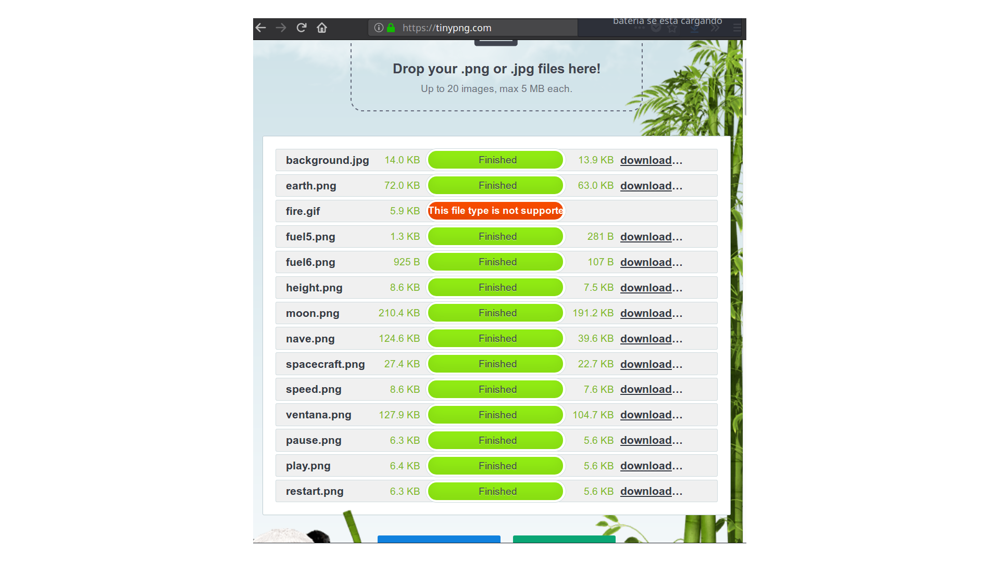

# Lunar Lander, versión de JavaScrip 
 
## Información general 
 
+ Proyecto original de: David Villalba 
+ Curso: 2017-18 
+ Clase: DAM 1A 
+ [Link a RawGit](https://rawgit.com/Pauuu/lunar-landing-javascript/master/lunarLander.html) 
 
### HTML e Imágenes 
[HTML Minimizado](https://github.com/Pauuu/lunar-landing-javascript/tree/HTML_Minimizado) 
 
 
Imágenes optimizadas: 
 
 
--- 
 
## Lunar lander 
El objetivo es aterrizar la nave con una velocidad menor a 5m/s. 
El juego tiene tres dificultades distintas: Fácil, Medio, Difícil. 
 
--- 
 
### Dificultades 
 
+ En Fácil: la gravedad es la que venia por defecto 
+ En Medio: la gravedad aumenta 10 veces respecto a Fácil 
+ En Difícil: La gravedad aumenta 10 veces respecto a Fácil y el combustible está al 50%. 
 
--- 
 
## Controles 
 
Para poder encender la nave basta con pulsar cualquier botón del teclado, la que al usuario le sea mas cómoda o pulsar el la pantalla con el ratón. 
Para la versión móvil, basta con pulsar la pantalla. 
 
--- 
 
##  Funcionamiento 
+ La nave tiene en medio un nivel de combustible, que va descendiendo a medida que el combustible gastando (el combustible inicial es de 90u, cada 15u desaparece un trozo de la barra de combustible). 
 
+ En el juego, hay dos botones disponibles: reinicio y pausa. 
 
El de reinicio: reinicia el juego. 
 
El de pausa: pausa el juego y muestra el menú. 
 
### Menú 
En el menú se muestran 4 opciones: 
+ Info: Muestra las instrucciones. 
+ Reanudar: te devuelve al juego donde lo dejaste. 
+ Dificultad (Fácil, Medio; Difícil): Cambia la dificultad. 
+ About: Sale del juego para redireccionar la página a este repositorio. Al pulsar, se muestra un mensaje "confirm" el cual el usuario pulsará aceptar o cancelar. Solo se saldrá si pulsa aceptar. 
 
--- 
 
 
